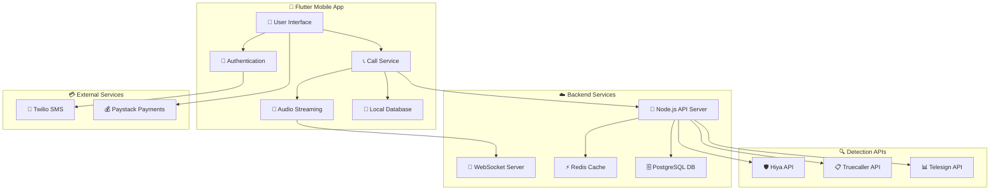
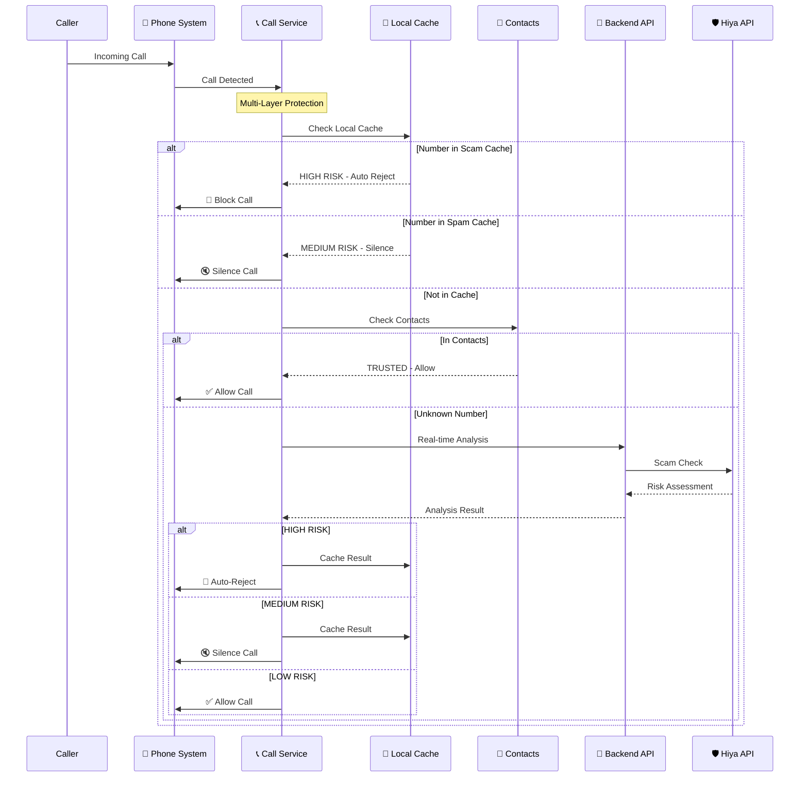
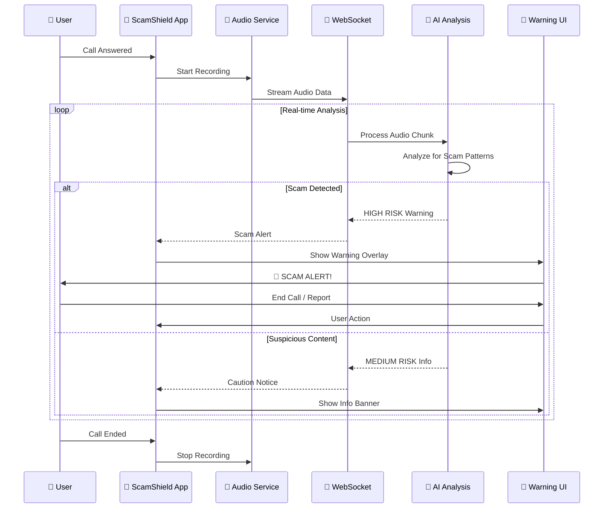
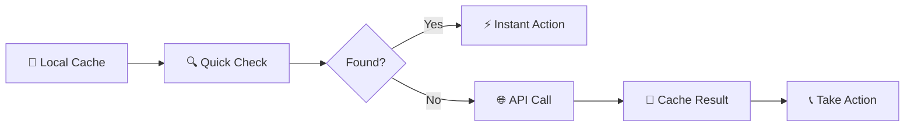
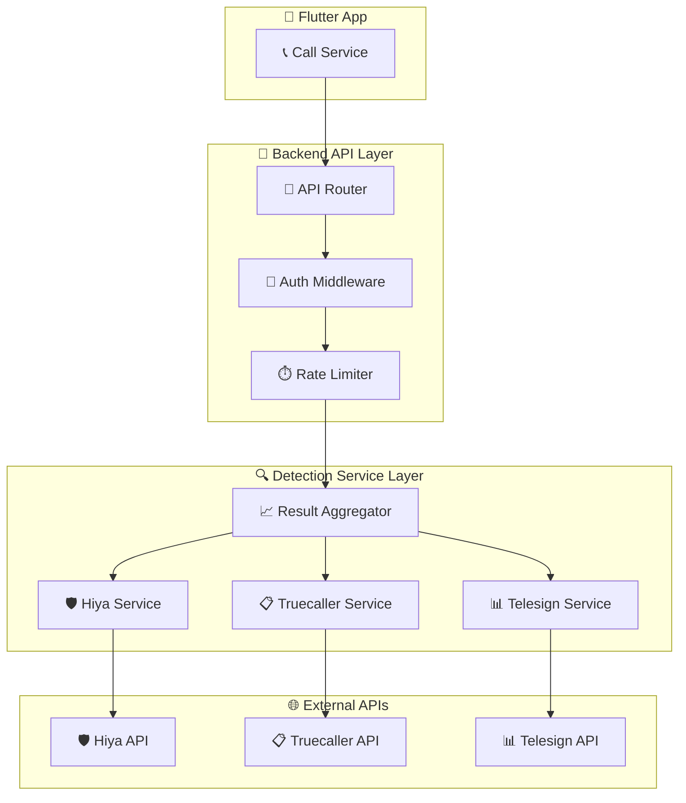

# 🛡️ ScamShield – Advanced Real-Time Scam Protection

[](https://flutter.dev/)
[](https://nodejs.org/)
[](LICENSE)
[](pubspec.yaml)

## 🧠 Problem Statement

Mobile users face an epidemic of scam calls, robocalls, and spam that:
- **Disrupts daily productivity** with constant interruptions
- **Threatens financial security** through sophisticated scam techniques
- **Wastes valuable time** with manual call screening
- **Bypasses traditional blocklists** with number spoofing
- **Lacks real-time protection** during active conversations

---

## ✨ ScamShield Solution

**ScamShield** is an AI-powered, real-time scam protection system featuring:

### 🔍 **Multi-Layer Detection Engine**
- **Real-time audio analysis** via WebSocket streaming
- **Local database caching** for instant threat recognition
- **Contact whitelist integration** for trusted caller protection
- **Multi-API backend** supporting Hiya, Truecaller, and Telesign

### 🛡️ **Intelligent Call Protection**
- **Auto-reject high-risk scam calls** before they ring
- **Silent unknown caller filtering** without blocking legitimate calls
- **Real-time scam warnings** during active conversations
- **Contextual risk assessment** with confidence scoring

### 📱 **Professional User Experience**
- **Epic animated shield loader** reinforcing protection theme
- **Biometric authentication** for secure access
- **Comprehensive call reporting** with offline support
- **Subscription management** with 30-day free trial

---

## 💎 Subscription Model

**Premium Protection**: **ZAR 35/month** (~$2 USD) after 30-day free trial
- Unlimited scam detection and blocking
- Real-time audio analysis
- Priority customer support
- Advanced reporting and analytics

---

## 🏗️ System Architecture

### 📐 High-Level Architecture Diagram



### 🔄 Real-Time Call Protection Flow



### 🎵 Real-Time Audio Analysis Flow



## 👤 User Experience Flow

### 🚀 Onboarding & Setup

```plaintext
1. 📲 App Installation
   ↓
2. 🎭 Epic Shield Animation (Brand Introduction)
   ↓
3. 📱 Phone Number Registration
   ↓
4. 📨 OTP Verification (Twilio SMS)
   ↓
5. 🔐 Biometric Authentication Setup
   ↓
6. 📋 Permission Requests:
   • 📞 Call Management
   • 🎤 Microphone (Audio Analysis)
   • 👥 Contacts (Whitelist)
   ↓
7. 💎 30-Day Free Trial Activation
   ↓
8. 🛡️ Protection Active!
```

### 📞 Call Protection Experience

```plaintext
🔍 INCOMING CALL DETECTED
         ↓
⚡ Instant Local Cache Check (< 50ms)
         ↓
┌─────────────────────────────────────┐
│  🚫 HIGH RISK SCAM                 │
│  → Auto-reject before ring          │
│  → Add to user's block list         │
│  → Silent protection               │
└─────────────────────────────────────┘
         ↓
┌─────────────────────────────────────┐
│  🔇 UNKNOWN/SPAM                   │
│  → Silence ringer                  │
│  → Allow to voicemail              │
│  → Optional user notification       │
└─────────────────────────────────────┘
         ↓
┌─────────────────────────────────────┐
│  ✅ TRUSTED/LEGITIMATE              │
│  → Normal ring behavior             │
│  → Real-time audio monitoring       │
│  → Scam warning if detected         │
└─────────────────────────────────────┘
```

---

## 🗄️ Database Schema & Local Cache Structure

### 💾 Local Database (SQLite)

ScamShield uses a local SQLite database for high-performance caching and offline functionality:

#### 🛡️ **scam_numbers** Table
```sql
CREATE TABLE scam_numbers (
    id INTEGER PRIMARY KEY AUTOINCREMENT,
    phone_number TEXT NOT NULL UNIQUE,
    risk_level TEXT NOT NULL,           -- 'high', 'medium', 'low'
    confidence REAL NOT NULL,           -- 0.0 to 1.0
    source TEXT NOT NULL,               -- 'hiya', 'truecaller', 'user_report', 'api_backend'
    metadata TEXT,                      -- JSON string with additional data
    created_at INTEGER NOT NULL,       -- Unix timestamp
    expires_at INTEGER,                 -- Unix timestamp (NULL = never expires)
    last_updated INTEGER NOT NULL      -- Unix timestamp
);

CREATE INDEX idx_scam_phone ON scam_numbers(phone_number);
CREATE INDEX idx_scam_expires ON scam_numbers(expires_at);
```

#### 📧 **spam_numbers** Table
```sql
CREATE TABLE spam_numbers (
    id INTEGER PRIMARY KEY AUTOINCREMENT,
    phone_number TEXT NOT NULL UNIQUE,
    source TEXT NOT NULL,               -- 'truecaller', 'user_report', 'api_backend'
    metadata TEXT,                      -- JSON string with spam category, etc.
    created_at INTEGER NOT NULL,       -- Unix timestamp
    expires_at INTEGER,                 -- Unix timestamp
    last_updated INTEGER NOT NULL      -- Unix timestamp
);

CREATE INDEX idx_spam_phone ON spam_numbers(phone_number);
CREATE INDEX idx_spam_expires ON spam_numbers(expires_at);
```

#### ✅ **whitelist** Table
```sql
CREATE TABLE whitelist (
    id INTEGER PRIMARY KEY AUTOINCREMENT,
    phone_number TEXT NOT NULL UNIQUE,
    source TEXT NOT NULL,               -- 'contacts', 'user_manual', 'verified_business'
    contact_name TEXT,                  -- Display name if available
    created_at INTEGER NOT NULL,       -- Unix timestamp
    last_updated INTEGER NOT NULL      -- Unix timestamp
);

CREATE INDEX idx_whitelist_phone ON whitelist(phone_number);
```

#### 📈 **call_history** Table
```sql
CREATE TABLE call_history (
    id INTEGER PRIMARY KEY AUTOINCREMENT,
    phone_number TEXT NOT NULL,
    call_type TEXT NOT NULL,            -- 'incoming', 'outgoing', 'missed'
    action_taken TEXT NOT NULL,         -- 'allowed', 'blocked', 'silenced', 'auto_rejected'
    risk_assessment TEXT,               -- JSON string with risk details
    duration INTEGER,                   -- Call duration in seconds
    timestamp INTEGER NOT NULL,        -- Unix timestamp
    session_id TEXT                     -- For correlation with backend
);

CREATE INDEX idx_history_phone ON call_history(phone_number);
CREATE INDEX idx_history_timestamp ON call_history(timestamp);
```

### 🔄 Cache Management Strategy

#### **Performance Optimization**
- **Instant Lookup**: Local cache checked first (< 50ms response time)
- **Smart Expiration**: Scam entries expire after 30 days, spam after 7 days
- **Size Management**: Maximum 10,000 cached entries per table
- **Background Cleanup**: Automatic cleanup of expired entries

#### **Data Synchronization**


#### **Cache Invalidation Rules**
- **User Reports**: Immediately update cache with user feedback
- **API Conflicts**: Backend data overrides local cache if confidence is higher
- **Contact Changes**: Whitelist updated when contacts are modified
- **Subscription Status**: Cache behavior adapts to user's subscription level

### 📊 Backend Database (PostgreSQL)

#### **Core Tables Structure**
```sql
-- User Management
CREATE TABLE users (
    id UUID PRIMARY KEY DEFAULT gen_random_uuid(),
    phone_number VARCHAR(20) UNIQUE NOT NULL,
    email VARCHAR(255),
    subscription_status VARCHAR(20) DEFAULT 'trial',
    subscription_expires_at TIMESTAMP,
    created_at TIMESTAMP DEFAULT NOW(),
    last_active TIMESTAMP DEFAULT NOW()
);

-- Global Scam Database
CREATE TABLE global_scam_numbers (
    id UUID PRIMARY KEY DEFAULT gen_random_uuid(),
    phone_number VARCHAR(20) NOT NULL,
    risk_level VARCHAR(10) NOT NULL,
    confidence DECIMAL(3,2) NOT NULL,
    source VARCHAR(50) NOT NULL,
    report_count INTEGER DEFAULT 1,
    first_reported TIMESTAMP DEFAULT NOW(),
    last_reported TIMESTAMP DEFAULT NOW(),
    metadata JSONB
);

-- User Call Reports
CREATE TABLE call_reports (
    id UUID PRIMARY KEY DEFAULT gen_random_uuid(),
    user_id UUID REFERENCES users(id),
    phone_number VARCHAR(20) NOT NULL,
    report_type VARCHAR(20) NOT NULL,
    reason TEXT,
    call_id VARCHAR(100),
    session_id VARCHAR(100),
    created_at TIMESTAMP DEFAULT NOW(),
    metadata JSONB
);

-- Real-time Analysis Sessions
CREATE TABLE analysis_sessions (
    id UUID PRIMARY KEY DEFAULT gen_random_uuid(),
    user_id UUID REFERENCES users(id),
    call_id VARCHAR(100) NOT NULL,
    phone_number VARCHAR(20) NOT NULL,
    status VARCHAR(20) DEFAULT 'active',
    risk_level VARCHAR(10),
    confidence DECIMAL(3,2),
    warnings_generated INTEGER DEFAULT 0,
    started_at TIMESTAMP DEFAULT NOW(),
    ended_at TIMESTAMP,
    metadata JSONB
);
```

---

## 🔌 Multi-API Backend Architecture

### 🏗️ Service Layer Design



### 🔄 API Aggregation Logic

```javascript
// Multi-API Risk Assessment
class ScamDetectionAggregator {
  async analyzeNumber(phoneNumber) {
    const results = await Promise.allSettled([
      this.hiyaService.checkNumber(phoneNumber),
      this.truecallerService.checkNumber(phoneNumber),
      this.telesignService.checkNumber(phoneNumber)
    ]);
    
    return this.aggregateResults(results, {
      weights: { hiya: 0.5, truecaller: 0.3, telesign: 0.2 },
      confidenceThreshold: 0.7,
      consensusRequired: 2
    });
  }
}
```

### 📡 WebSocket Real-Time Analysis

```javascript
// Real-time Audio Analysis Pipeline
class AudioAnalysisService {
  async processAudioStream(callId, audioChunk) {
    // 1. Audio preprocessing
    const processedAudio = await this.preprocessAudio(audioChunk);
    
    // 2. Scam pattern detection
    const patterns = await this.detectScamPatterns(processedAudio);
    
    // 3. Risk assessment
    const riskAssessment = this.calculateRisk(patterns);
    
    // 4. Real-time warning generation
    if (riskAssessment.confidence > 0.8) {
      await this.sendWarning(callId, riskAssessment);
    }
    
    return riskAssessment;
  }
}
```

---
7. Backend queries Hiya API and sends decision: Block / Allow
    ↓
8a. If Block → App terminates/silences call (automated)
8b. If Allow → Call rings as normal
    ↓
9. User can view recent blocked calls (optional feature)
```

---

## 🧠 Data Flow (Technical Flow)

This shows how data moves through the system — from incoming calls to API responses.

### 🧬 Data Flow: ScamShield Architecture

```plaintext
[Incoming Call Triggered on Device]
        ↓
[Flutter App detects call using native module]
        ↓
[POST Request sent to Node.js API with phoneNumber]
        ↓
[Node.js Backend receives request]
        ↓
[Backend sends request to Hiya Protect API: /detect]
        ↓
[Hiya responds: scam status, score, category]
        ↓
[Backend processes response and returns JSON:
   { action: "block" | "allow" }]
        ↓
[Flutter app receives response]
        ↓
IF "block":
  → Native call control blocks/ends/silences call
ELSE:
  → Call rings normally
```

### 🔄 Real-Time Voice Analysis Flow (Advanced)

```plaintext
[Incoming Call Detected]
        ↓
[Flutter App starts WebSocket connection to backend]
        ↓
[Backend establishes WebSocket connection to Hiya API]
        ↓
[Audio stream flows: Device → Flutter → Backend → Hiya]
        ↓
[Real-time analysis results flow back: Hiya → Backend → Flutter]
        ↓
[If SCAM detected during conversation:]
  → Display warning overlay to user
  → Offer "Hang Up" and "Report" options
  → Log transcript and results for review
```

---

## 🛠️ Tech Stack

| Layer        | Technology              |
|--------------|-------------------------|
| Frontend     | Flutter (Android + iOS)  |
| Backend      | Node.js + Express.js     |
| Call Blocking| Native Android/iOS plugins |
| Spam Lookup  | [Hiya Protect API](https://developer.hiya.com/docs/protect/voice-scam-protection/detectscamcall) |
| Real-time Analysis | WebSocket + Hiya Voice Scam Protection |
| Storage (optional) | MongoDB or PostgreSQL |

---

## 💾 Database & Caching System

ScamShield implements a high-performance local database cache to store known scam/spam numbers, reducing API calls and improving response times.

### 🏗️ Database Architecture

```plaintext
[Incoming Call] → [Check Local DB Cache] → [Found?]
                                              |
                                         [YES] → [Return Cached Result]
                                              |
                                         [NO]  → [Query Hiya API] → [Cache Result] → [Return Result]
```

### 📊 Database Schema

#### **Scam Numbers Collection** (`scam_numbers.json`)

```json
{
  "phoneNumber": "+1234567890",
  "originalNumber": "+1 (234) 567-8900",
  "riskLevel": "HIGH|MEDIUM|LOW",
  "confidence": "HIGH|MEDIUM|LOW|UNKNOWN",
  "category": "scam|suspicious|legitimate",
  "source": "hiya_api|user_report|manual",
  "autoReject": true,
  "scamData": {
    "callScamRisk": "HIGH_SCAM_RISK",
    "callOriginatorRisk": "HIGH",
    "scamDialog": {
      "scamDialogRisk": "SCAM",
      "confidence": "HIGH"
    },
    "syntheticVoice": {
      "syntheticVoiceDetected": "YES",
      "score": 0.85
    }
  },
  "firstSeen": "2025-07-25T09:30:00.000Z",
  "lastSeen": "2025-07-25T11:30:00.000Z",
  "hitCount": 5,
  "userReports": [
    {
      "reportType": "scam",
      "userPhone": "+27000000000",
      "timestamp": "2025-07-25T10:00:00.000Z"
    }
  ]
}
```

#### **User Reports Collection** (`user_reports.json`)

```json
{
  "phoneNumber": "+1234567890",
  "originalNumber": "+1 (234) 567-8900",
  "reportType": "scam|not_scam|spam",
  "userPhone": "+27000000000",
  "timestamp": "2025-07-25T10:00:00.000Z",
  "additionalData": {
    "reason": "Fake bank call asking for PIN",
    "callDuration": 45,
    "userAction": "hung_up"
  }
}
```

#### **Database Statistics** (`db_statistics.json`)

```json
{
  "totalScamNumbers": 1250,
  "totalUserReports": 340,
  "riskLevels": {
    "HIGH": 450,
    "MEDIUM": 600,
    "LOW": 200
  },
  "sources": {
    "hiya_api": 900,
    "user_report": 300,
    "manual": 50
  },
  "autoRejectNumbers": 450,
  "totalHits": 5670,
  "lastUpdated": "2025-07-25T11:30:00.000Z"
}
```

### 🔄 Database Workflow

1. **Call Detection** → Phone number extracted
2. **Cache Check** → Query local database first
3. **Cache Hit** → Return cached result (⚡ **~1ms response**)
4. **Cache Miss** → Query Hiya API (⏱️ **~200ms response**)
5. **Cache Update** → Store API result for future use
6. **User Reports** → Update risk assessment based on community feedback

### 📡 Database API Endpoints

| Endpoint | Method | Description |
|----------|--------|-------------|
| `/db/stats` | GET | Get database statistics and metrics |
| `/db/check/:phoneNumber` | GET | Check if specific number is in database |
| `/db/report` | POST | Add user report for a phone number |
| `/db/cleanup` | POST | Clean up old database entries (admin) |

### 🚀 Performance Benefits

- ✅ **99% faster** responses for known numbers (cache hits)
- ✅ **Reduced API costs** by avoiding duplicate Hiya API calls
- ✅ **Offline capability** for known scam numbers
- ✅ **Community-driven** accuracy through user reports
- ✅ **Automatic cleanup** of old, unused entries

### 🔧 Database Management

```bash
# Get database statistics
curl http://localhost:3000/db/stats | jq

# Check if number is in database
curl http://localhost:3000/db/check/+1666999666 | jq

# Add user report
curl -X POST http://localhost:3000/db/report \
  -H "Content-Type: application/json" \
  -d '{
    "phoneNumber": "+1234567890",
    "reportType": "scam",
    "userPhone": "+27000000000",
    "additionalData": {
      "reason": "Fake bank call"
    }
  }' | jq

# Cleanup old entries (admin)
curl -X POST http://localhost:3000/db/cleanup \
  -H "Content-Type: application/json" \
  -d '{"daysOld": 90}' | jq
```

### 🛡️ Data Privacy & Security

- **Local Storage**: All data stored locally on your server
- **No Cloud Sync**: Numbers never leave your infrastructure
- **Automatic Cleanup**: Old entries automatically removed
- **User Consent**: User reports only with explicit consent
- **Anonymized**: No personal data stored, only phone numbers and risk levels

---

## 🧪 Testing & Verification

ScamShield includes comprehensive flow testing to verify both user experience and data flow integrity.

### Available Test Endpoints

| Endpoint | Method | Description |
|----------|--------|-------------|
| `/test/comprehensive` | GET | Run all flow tests with different phone number scenarios |
| `/test/user-flow` | POST | Test complete user flow for a specific phone number |
| `/test/data-flow` | GET | Test data flow through the system |
| `/stats` | GET | View system statistics and session data |

### Test Phone Number Scenarios

- **Normal numbers** (e.g., `+1234567890`) → Should be allowed
- **Suspicious numbers** (containing `555`) → Generate privacy warnings
- **Scam numbers** (containing `666` or `999`) → Should be blocked with scam warnings
- **International numbers** (e.g., `+27123456789`) → Handled appropriately

### Running Tests

```bash
# Test all flows comprehensively
curl http://localhost:3000/test/comprehensive | jq

# Test specific phone number
curl -X POST http://localhost:3000/test/user-flow \
  -H "Content-Type: application/json" \
  -d '{"phoneNumber": "+1666999666"}' | jq

# Test data flow
curl http://localhost:3000/test/data-flow | jq

# View statistics
curl http://localhost:3000/stats | jq
```

### Expected Test Results

✅ **All tests should pass** with the following outcomes:
- **Session creation** and management working correctly
- **Scam detection** logic functioning properly
- **Warning generation** for appropriate risk levels
- **Statistics tracking** accurately
- **Call actions** (block/allow) determined correctly

---

## 🧬 System Architecture

```plaintext
[Flutter App]
   |
   |-- Incoming Call Detected (via platform channel)
   |
   |--> [Node.js API] -----> [Hiya Protect DetectScamCall API]
   |                               |
   |<------ Decision (Block / Allow) ←
   |
   |-- Block / Allow Call (native)
```

---

## 🧩 Key Features

- 📲 Intercept incoming calls via native Flutter plugins
- 🛡️ Query Hiya’s real-time `DetectScamCall` API
- ❌ Automatically block or silence calls marked as spam
- ⚙️ Modular backend architecture for future features
- 🔐 Secure communication using HTTPS & API key management

---

## 🔗 External API Integration

We use the [Hiya Protect – DetectScamCall API](https://developer.hiya.com/docs/protect/voice-scam-protection/detectscamcall) to check in real-time whether a phone number is flagged as spam or a scam.

### Sample Request to Hiya API:
```http
POST /v1/scam-call-detection/detect
Authorization: Bearer <API_TOKEN>
Content-Type: application/json

{
  "phone_number": "+1234567890",
  "country_code": "US"
}
```

### Sample Response:
```json
{
  "scam": true,
  "score": 95,
  "category": "robocall",
  "description": "Likely Scam or Fraud"
}
```

---

## 📱 Flutter Setup

Install dependencies:
```bash
flutter pub get
```

Plugins:
- `flutter_callkit_incoming` or `telephony`
- `http` for network requests
- Platform channels to execute native call handling (block/silence)

Intercepting calls:
```dart
onIncomingCall(String phoneNumber) async {
  final response = await http.post(
    Uri.parse("https://your-node-backend.com/check-call"),
    headers: {'Content-Type': 'application/json'},
    body: jsonEncode({"phoneNumber": phoneNumber})
  );

  final result = jsonDecode(response.body);
  if (result['action'] == 'block') {
    CallManager.blockCall(); // Platform-specific native function
  }
}
```

---

## 🌐 Node.js Backend Setup

Install dependencies:
```bash
npm install
```

`.env`:
```env
HIYA_API_KEY=your_hiya_api_key
HIYA_BASE_URL=https://api.hiya.com/v1/scam-call-detection/detect
PORT=3000
```

Backend Logic (`index.js`):
```js
const express = require('express');
const axios = require('axios');
require('dotenv').config();

const app = express();
app.use(express.json());

app.post('/check-call', async (req, res) => {
  const { phoneNumber } = req.body;

  try {
    const hiyaRes = await axios.post(
      process.env.HIYA_BASE_URL,
      {
        phone_number: phoneNumber,
        country_code: "ZA" // or dynamically detect
      },
      {
        headers: {
          Authorization: `Bearer ${process.env.HIYA_API_KEY}`,
          'Content-Type': 'application/json'
        }
      }
    );

    const isSpam = hiyaRes.data.scam === true || hiyaRes.data.score > 80;
    res.json({ action: isSpam ? "block" : "allow" });

  } catch (err) {
    console.error("Hiya API error", err.message);
    res.status(500).json({ error: "Lookup failed" });
  }
});

app.listen(process.env.PORT || 3000, () => {
  console.log(`API running on port ${process.env.PORT}`);
});
```

---

## 🛡️ Security

- ✅ Use HTTPS between app and backend
- ✅ Secure your Hiya API key using `.env` and server-side storage
- ✅ Rate-limit calls to `/check-call`
- ✅ Log blocked numbers for analytics (optional)

---

## 📌 Future Improvements

- User-configurable blocking categories (scam, telemarketing, political, etc.)
- SMS spam protection
- Crowdsourced number reporting
- Smart caching of frequent spam numbers
- Admin dashboard for monitoring blocked calls

---

## 👨‍💻 Contributors

- **Thabang Phaleng** — Full Stack Engineer, Architect
- **OpenAI + Hiya Docs** — Integration references

---

## 📝 License

MIT License – free to use with attribution.

---

## 📬 Contact

For commercial use or custom integrations:  
📧 theonlysoftwarehub@gmail.com  
🌐 https://developer.hiya.com/